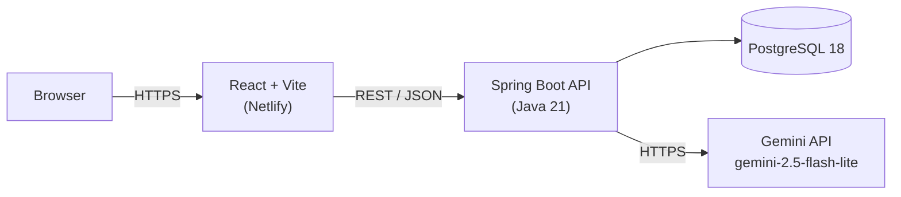

# SplitSmart — Backend

Spring Boot API for [SplitSmart](https://github.com/yashika807/Splitsmart-frontend),
a group expense splitter. Handles expense persistence and proxies natural-language
expense parsing to Google's Gemini API so the API key never has to live in the
browser.

## Tech stack

Java 21, Spring Boot 3.5 (Web, Data JPA), PostgreSQL 18. Talks to Gemini
directly over `java.net.http.HttpClient` — no SDK dependency.

## Architecture



## Getting started

1. Have PostgreSQL 18 running locally with a `splitsmart` database.
2. Copy the properties template and fill in your own values:
   ```bash
   cp src/main/resources/application.properties.example src/main/resources/application.properties
   ```
3. Set the two required env vars (or set them in your IDE's run
   configuration — that's how this project was developed):
   ```bash
   export DB_PASSWORD=your_postgres_password
   export GEMINI_API_KEY=your_gemini_api_key
   ```
4. Run it:
   ```bash
   ./mvnw spring-boot:run
   ```

Starts on `http://localhost:8080`.

### Environment variables

| Variable | Purpose |
|---|---|
| `DB_PASSWORD` | Postgres password for the `postgres` user |
| `GEMINI_API_KEY` | API key for the Gemini API ([get one here](https://aistudio.google.com/apikey)) |

`application.properties` itself only contains `${DB_PASSWORD}` /
`${GEMINI_API_KEY}` placeholders — the real values never get committed.

## API reference

Base URL: `http://localhost:8080/api/expenses`

### `GET /api/expenses`

Returns all expenses.

```json
[
  { "id": 1, "name": "Rahul", "amount": 500.0, "context": "Trip" }
]
```

### `POST /api/expenses`

Creates an expense. `context` is optional and defaults to `"Trip"`.

```json
// Request
{ "name": "Rahul", "amount": 500, "context": "Family" }

// Response — 200, the created expense with its id
{ "id": 4, "name": "Rahul", "amount": 500.0, "context": "Family" }
```

### `DELETE /api/expenses/{id}`

Deletes an expense by id. No response body.

### `POST /api/expenses/parse`

Sends free text to Gemini and gets back structured expenses. Used by the
AI input box on the frontend.

```json
// Request
{ "text": "Rahul paid 500 for dinner, Mini spent 800 on the cab" }

// Response — 200
[
  { "name": "Rahul", "amount": 500.0 },
  { "name": "Mini", "amount": 800.0 }
]
```

Returns a 500 with an error body if Gemini's response doesn't parse as the
expected JSON shape (this does happen — Gemini occasionally wraps output in
markdown fences or misformats a number).

### `POST /api/expenses/parse-receipt`

The flagship feature: send a photo of a receipt (`multipart/form-data`,
field name `file`, image types only, 10MB cap), get back every line item
Gemini could read plus subtotal/tax/tip. `price` is the *unit* price —
Gemini is prompted to divide out quantity itself (e.g. "Cold Brew x2 ₹180.00"
on the receipt comes back as `price: 90.0, quantity: 2`), not the line total.

```bash
curl -X POST http://localhost:8080/api/expenses/parse-receipt \
  -F "file=@receipt.jpg"
```

```json
// Response — 200
{
  "items": [
    { "itemName": "Cold Brew", "price": 90.0, "quantity": 2 },
    { "itemName": "Veg Sandwich", "price": 220.0, "quantity": 1 }
  ],
  "subtotal": 520.0,
  "tax": 26.0,
  "tip": 54.0
}
```

`subtotal`, `tax`, and `tip` are `null` if Gemini couldn't find them on the
receipt — the frontend treats missing tax/tip as 0 and lets the user fill
them in.

Error responses, all with an `{"error": "..."}` body:

| Status | When |
|---|---|
| 400 | No file, or the file isn't an image |
| 422 | Gemini couldn't read the receipt, returned unparseable JSON, or found zero line items |
| 500 | Anything else unexpected |

This endpoint reuses `GeminiService`'s HTTP-call machinery rather than
duplicating it — see [What I learned](#what-i-learned).

The item-to-person assignment, and the proportional tax/tip math, happen
entirely on the frontend; this endpoint only does the vision parsing. See
the [frontend README](https://github.com/yashika807/Splitsmart-frontend#receipt-splitting-in-detail)
for the full flow and the data-model reasoning.

## What I learned

- **Keeping secrets server-side isn't automatic — it's a design decision.**
  The AI parsing feature originally called Gemini directly from the browser,
  which meant the API key had to ship in the frontend bundle. Moving it here,
  behind `POST /api/expenses/parse`, was the actual fix — not just hiding the
  key better, but making sure it's structurally impossible for the client to
  need it.
- **`spring.jpa.hibernate.ddl-auto=update` is a fast way to iterate on a
  schema in development** — adding the `context` field to `Expense` required
  no manual migration, Hibernate just added the column. Fine for a solo
  learning project; I wouldn't run this in a real production system, where
  I'd want versioned migrations (Flyway/Liquibase) instead.
- **LLM APIs need defensive parsing, not just a happy-path deserializer.**
  `GeminiService` strips markdown fences and checks for a `candidates` field
  before trusting the response — Gemini doesn't always return clean JSON on
  the first try.
- **`java.net.http.HttpClient` is enough for simple outbound API calls.**
  Didn't need a REST client library or SDK just to POST JSON to Gemini and
  read the response back.
- **Multimodal prompts are just more `parts` in the same request shape.**
  Adding image support to `GeminiService` didn't need a different API or
  library — Gemini's `generateContent` endpoint takes a `parts` array that
  can mix `{"text": ...}` and `{"inline_data": {mime_type, data}}` entries
  in one request. Refactoring the text-only version to send `List<Part>`
  instead of a single prompt string, and extracting the shared HTTP-call
  and response-unwrapping logic into one `callGemini()` helper, meant the
  vision call didn't duplicate a single line of request/response handling
  — the two entry points differ only in what parts they send and how they
  interpret the returned JSON.
- **Not every "can't happen" case is actually rare.** Gemini reading a
  receipt photo fails more often than parsing typed text — bad lighting,
  a blurry photo, a receipt with no readable items. `parseReceipt` treats
  "zero items found" and "response isn't valid JSON" as expected outcomes
  with their own error messages, not generic 500s.

## Roadmap

- [x] Expense CRUD
- [x] Gemini-backed natural language parsing endpoint
- [x] Trip/Family context field on expenses
- [x] Receipt photo parsing endpoint (vision, itemized, with tax/tip detection)
- [x] Secrets kept out of source control
- [ ] Deployed anywhere — currently local-only, no Render/Railway/Fly.io setup
- [ ] Real test coverage — only the default Spring Boot smoke test exists
- [ ] Input validation (negative amounts, blank names, oversized text to `/parse`)
- [ ] CORS restricted to the actual frontend origin (currently `@CrossOrigin(origins = "*")`)
- [ ] Database migrations via Flyway instead of `ddl-auto=update`
- [ ] Auth — there's currently no concept of a user, every expense is global
